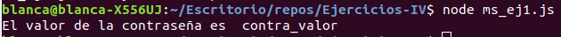

# Ejercicios de Microservicio

## Ejercicio 1

*Instalar etcd3, averiguar qué bibliotecas funcionan bien con el lenguaje que estemos escribiendo el proyecto (u otro lenguaje), y hacer un pequeño ejemplo de almacenamiento y recuperación de una clave; hacer el almacenamiento desde la línea de órdenes (con etcdctl) y la recuperación desde el mini-programa que hagáis.*

Voy a usa la biblioteca [etcd3](https://www.npmjs.com/package/etcd3). Para instalarla hago npm install --save etcd3.   
Para instalar la orden etcdctl instalamos etcd con sudo apt install etcd.    
Con etcdctl -version obtenemos: etcdctl version: 3.2.17
API version: 2   

Hacemos export ETCDCTL_API=3 y ahora sale: etcdctl version: 3.2.17
API version: 3.2   

Ahora hacemos: etcdctl put contra_key contra_valor que devuelve OK.

El código del [fichero](../ms_ej1.js) es este:

```
const { Etcd3 }= require("etcd3");
const client = new Etcd3();

(async () => {
    const valor = await client.get("contra_key").string();
    console.log("El valor de la contraseña es ", valor);
    await client.delete().all();
})();
```
y el resultado:   




## Ejercicio 2
*Realizar una aplicación básica que use express para devolver alguna estructura de datos del modelo que se viene usando en el curso.*

Primero instalamos express con npm install --save express. Y el código para realizar la aplicación está en [este fichero](../ms_ej2):

```
var express = require("express");
var app = express();
var port = process.env.PORT || 8080

const Registro_libros = require("../Lecturas/src/Registro_libros.js");
const Libro = require("../Lecturas/src/Libro.js");

const libro_momo = new Libro("Momo", "Michael Ende", "Me ha gustado mucho", 8);


app.get("/", function(req, res){
    reg = new Registro_libros();
    reg.registrarLibro(libro_momo);
    res.send(reg);
});

app.listen(port);
console.log("Servidor en el http://127.0.0.1" + port + "/");
```

solo tiene implementado que en / devuelva un registro en el cual se ha insertado un libro. 


## Ejercicio 3

*Programar un microservicio en express (o el lenguaje y marco elegido) que incluya variables como en el caso anterior.*

He implementado esta función:   

```
app.put("/libro/:nombre/:autora/:comentario/:puntuacion",
    function(req, res){
        var nuevo_libro = new Libro(req.params.nombre, req.params.autora, req.params.comentario, req.params.puntuacion);
        reg.registrarLibro(nuevo_libro);
        res.send(nuevo_libro);
    }
)
```

Para probarlo usamos curl:   
```

curl -X PUT "http://127.0.0.1:8080/libro/La%20sombra%20del%20viento/Carlos%20Ruiz%20Zafón/Misterioso%20y%20entretenido/7"
```
que nos devuelve:   

{"nombre":"La sombra del viento","autora":"Carlos Ruiz Zafón","comentario":"Misterioso y entretenido","puntuacion":"7"}
 
Y si ahora hacemos curl http://127.0.0.1:8080, obtenemos el registro entero en el cual, efectivamente, está incluido el último libro.


