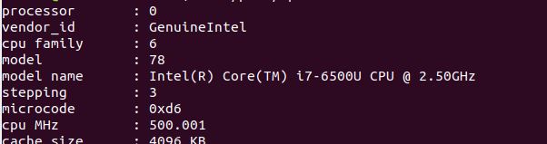

# Ejercicios Tema 1

## Ejercicio 1

*Consultar en el catálogo de alguna tienda de informática el precio de un ordenador tipo servidor y calcular su coste de amortización a cuatro y siete años. Consultar [este artículo en Infoautónomos sobre el tema](infoautonomos.eleconomista.es/consultas-a-la-comunidad/988/).*

He escogido este [ordenador](https://www.pccomponentes.com/dell-poweredge-t140-intel-xeon-e-2134-16gb), cuyo precio es 1095 euros, para calcular el coste amortización:

- A cuatro años, sería un 25% de amortización (que además es el máximo) --> 1095 * 25/100 = 273,75 euros al año

- A siete años, sería un 14,29% de amortización (100 / 7) --> 1095 * 14,29/100 = 156,43 euros al año

## Ejercicio 2

*Usando las tablas de precios de servicios de alojamiento en Internet “clásicos”, es decir, que ofrezcan Virtual Private Servers o servidores físicos, y de proveedores de servicios en la nube, comparar el coste durante un año de un ordenador con un procesador estándar (escogerlo de forma que sea el mismo tipo de procesador en los dos vendedores) y con el resto de las características similares (tamaño de disco duro equivalente a transferencia de disco duro) en el caso de que la infraestructura comprada se usa solo el 1% o el 10% del tiempo.*

He buscado una empresa que ofrece ambos tipos de hosting, tanto [VPS](https://www.ionos.es/servidores/vps) como [Cloud Hosting](https://www.ionos.es/cloud/servidores-cloud?linkId=ct.btn.content-cards.cards.card1.ms-sobre-los-servidores-cloud)

En el caso del VPS, tomando el caso de un ordenador de 4GB RAM, 2 cores y 120 GB SSD, para un año. Costaría 5 euros al mes los 6 primeros meses y luego 10 euros al mes, es decir, 90 euros al año. 

En el caso de Cloud Hosting, tomamos las mismas características del ordenador previo exceptuando el almacenamiento SSD, que sería de 80 GB, y nos encontramos que el precio sería 0,0333 euros la hora. 

- En el caso de que al infraestructura fuera usada solo el 1% del tiempo:  
Para VPS --> 90 euros  
Para Cloud Hosting --> 2,92 euros

- En el caso del 10 %:  
Para VPS --> 90 euros  
Para Cloud Hosting --> 29,17 euros  

## Ejercicio 3

*En general, cualquier ordenador con menos de 5 o 6 años tendrá estos flags. ¿Qué modelo de procesador es? ¿Qué aparece como salida de esa orden? Si usas una máquina virtual, ¿qué resultado da? ¿Y en una Raspberry Pi o, si tienes acceso, el procesador del móvil?*

Vemos que modelo tiene el procesador:

y ejecutando el comando egrep '^flags.*(vmx|svm)' /proc/cpuinfo: 

Vemos que en nuestro caso está activada. 

## Ejercicio 4

*Instalar un hipervisor para gestionar máquinas virtuales, que más adelante se podrá usar en pruebas y ejercicios. Usar siempre que sea posible un hipervisor que sea software libre.*

Tengo instalado VirtualBox para gestionar máquinas virtuales

## Ejercicio 5

*Darse de alta en una web que permita hacer pruebas con alguno de los sistemas de gestión de nube libres como los mencionados en los párrafos anteriores, aunque sea temporalmente. Si la prueba es menos de un mes, simplemente anotarlo y dejarlo para el mes de diciembre, más o menos.*

Me he registrado en [OpenStack](https://www.openstack.org/)

