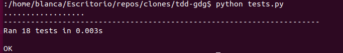
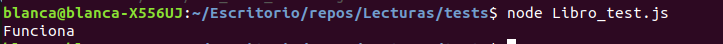
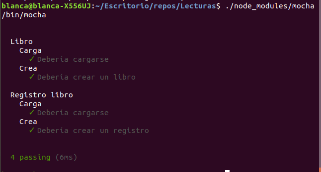

# Ejercicios Tema 2

## Ejercicio 1

*Descargar y ejecutar las pruebas de alguno de los proyectos anteriores, y si sale todo bien, hacer un pull request a alguno de esos proyectos con tests adicionales, si es que faltan (en el momento que se lea este tema).*

Me he descargado el proyecto [Pachanguillas TDD](https://github.com/JJ/tdd-gdg)
Se tratan de tests unitario en python.
Para ejecutarlo hacemos python tests.py  

## Ejercicio 2

*Para la aplicación que se está haciendo, escribir una serie de aserciones y probar que efectivamente no fallan. Añadir tests para una nueva funcionalidad, probar que falla y escribir el código para que no lo haga (vamos, lo que viene siendo TDD)*

He creado un par de aserciones para la clase Libro de mi proyecto, comprueba la funcion getNombre y to_string, el código sería el siguiente:

var Libro = require("../src/Libro.js")
const assert = require("assert");

var nuevo_libro = new Libro("Momo", "Michael Ende", "Me ha gustado mucho", 8);
assert(nuevo_libro, "Creado Libro");
assert.equal(nuevo_libro.getNombre(), "Momo", "Creado");
assert.equal(nuevo_libro.as_string(), "Momo - Michael Ende - Me ha gustado mucho - 8", "Creado");
console.log("Funciona");

## Ejercicio 3

*Crear algún conjunto de scripts de tests, usando tu lenguaje favorito, y ejecutarlos desde el marco de test más adecuado (o el que más te guste) para ese lenguaje.*

He creado un par de tests, para registro de libros y para libro tal que: 

//Registro_test.js
var Registro_libro = require("../src/Registro_libros.js")
var Libro = require("../src/Libro.js");
const assert = require("assert");
const { isMainThread } = require("worker_threads");

describe("Registro libro", function(){
    describe("Carga", function(){
        it("Debería cargarse", function(){
            assert(Registro_libro, "Cargado");
        });
    });

    describe("Crea", function(){
        it("Debería crear un registro", function(){
            var nuevo_registro = new Registro_libro();
            var libro = new Libro("Momo", "Michael Ende", "Me ha gustado mucho", 8);
            nuevo_registro.registrarLibro(libro);
            assert.equal(nuevo_registro.mostrarInformacion("Momo"), "Momo - Michael Ende - Me ha gustado mucho - 8", "Creado");
        });
    });
});

//Libro_test.js
var Libro = require("../src/Libro.js")
const assert = require("assert");
const { isMainThread } = require("worker_threads");

describe("Libro", function(){
    describe("Carga", function(){
        it("Debería cargarse", function(){
            assert(Libro, "Cargado");
        });
    });

    describe("Crea", function(){
        it("Debería crear un libro", function(){
            var nuevo_libro = new Libro("Momo", "Michael Ende", "Me ha gustado mucho", 8);
            assert.equal(nuevo_libro.as_string(), "Momo - Michael Ende - Me ha gustado mucho - 8", "Creado");
        });
    });
});

Me he instalado [mocha](https://mochajs.org/#configuring-mocha-nodejs) y al ejecutarlo sale:

