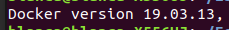
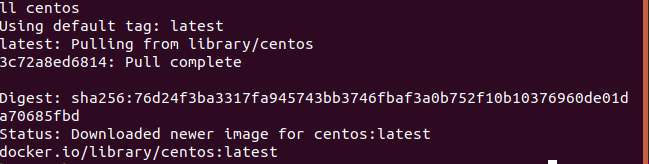
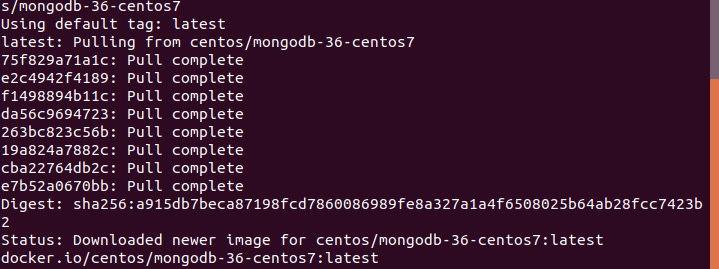
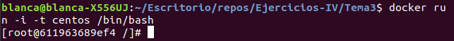
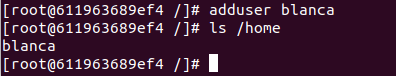
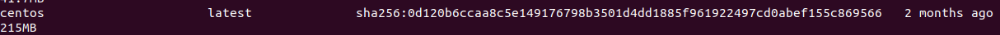
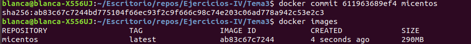

# Ejercicios Tema 3

## Ejercicio 1

*Instalar docker y/o otro gestor de contenedores como Podman/Buildah.*

Ya tengo docker instalado

## Ejercicio 2

*1. Instalar a partir de docker una imagen alternativa de Ubuntu y alguna adicional, por ejemplo de CentOS.  
2. Buscar e instalar una imagen que incluya MongoDB*

Vamos a crear el contenedor descargándolo del repositorio oficial. Voy a descargar el de centOS

la orden es: docker pull centos

Para una imagen que incluya MongoDB he encontrado una que es centos/mongodb-36-centos7

docker pull centos/mongodb-36-centos7

## Ejercicio 3

*Crear un usuario propio e instalar alguna aplicación tal como nginx en el contenedor creado de esta forma, usando las órdenes propias del sistema operativo con el que se haya inicializado el contenedor.*

Voy a hacerlo en el contenedor de centOS. Para ello, primero ejecutamos el comando docker run -i -t centos /bin/bash para abrir una terminal. 

En centOS para crear una cuenta de usuario se usa adduser:

para poner la contraseña se usa el comando psswd:
passwd blanca.  
Para instalar una aplicación usamos yum:
- yum install nginx

## Ejercicio 4

*Crear a partir del contenedor anterior una imagen persistente con commit.*

Para encontrar información sobre qué IP usa, lxs usuarixs y claves, primero buscamos el ID largo del contenedor con docker images --no-trunc

Con docker inspect 0d120b6ccaa8c5e149176798b3501d4dd1885f961922497cd0abef155c869566 obtenemos esa información.  

Para hacer lo del commit:  

611963689ef4 es el id del contenedor. Con docker commit 611963689ef4 hacemos un commit. Eso crea una imagen persistente de dicho contenedor.  
[Más información](https://docs.docker.com/engine/reference/commandline/commit/) sobre esta función.  

# Ejercicio 5

*Crear un Dockerfile para el servicio web que testee la clase que se ha venido desarrollando hasta ahora.*